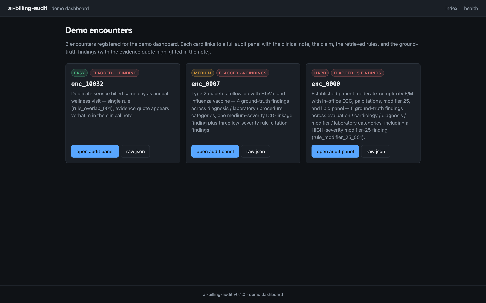
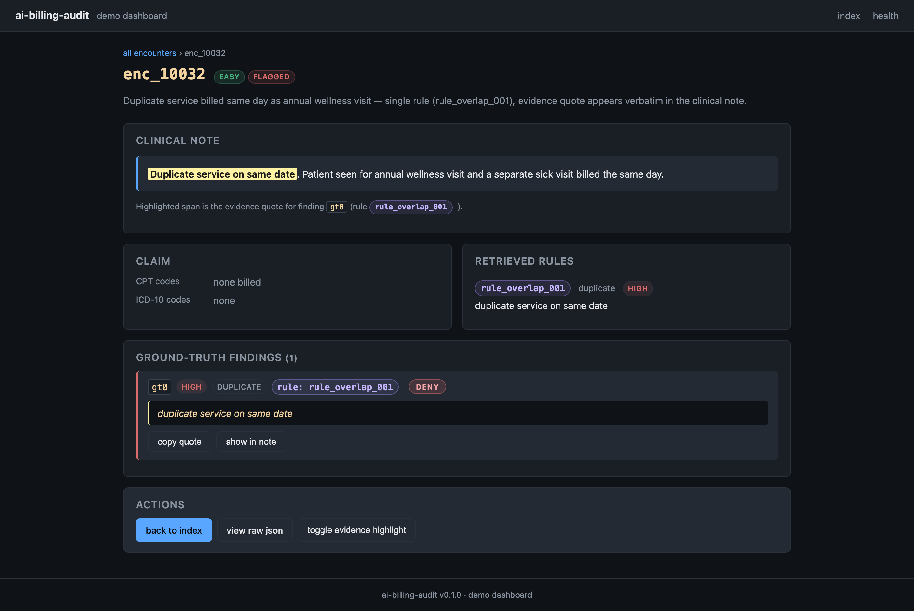
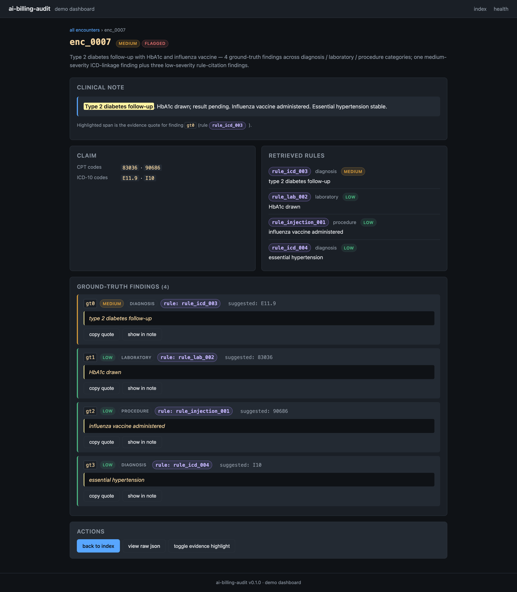
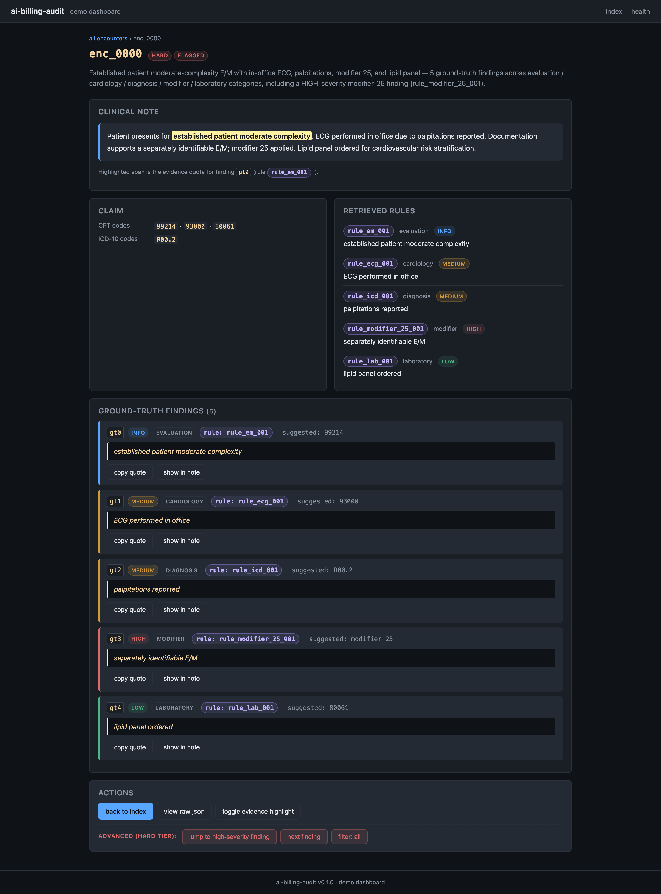

# ai-billing-audit

LLM-driven medical billing compliance auditor. Given a clinical encounter,
the claim being submitted, and a set of retrieved billing rules, an LLM
auditor emits a structured findings list (category, suggested code, quote,
severity, rule citations). A separate grading module compares auditor
findings to ground-truth findings and scores the system on R/P. A DSPy
MIPROv2 optimizer tunes the auditor prompt against that grader signal,
closing the loop until the system reaches R≥0.95, P≥0.80.

The product is intended for pre-submission review of medical claims
(E/M documentation, NCCI Procedure-to-Procedure edits, MUE edits, and
related payer rules) — the auditor flags claims where the documentation
does not justify the code being billed. LLM access is vendor-neutral via
the [`litellm`](https://github.com/BerriAI/litellm) library; the active
provider is selected by environment variable, not by code branch.

## What the MVP does

Takes a single medical encounter as input (claim, retrieved rules, and
clinical note), returns a structured audit result with zero or more
findings. Each finding cites the specific retrieved rule(s) it is
grounded in, includes a verbatim quote from the clinical note, and
flags a severity from `info` to `critical`. The MVP proves the
self-improvement loop works end-to-end on a small synthetic dataset
(synth agent → auditor → grader → MIPROv2 prompt optimizer) and
demonstrates the LLM-agnostic claim by running the same code against
multiple providers and comparing R/P within 5%.

## Screenshots

Live dashboard captures from the demo build (FastAPI + uvicorn on
:8765, three encounters registered: EASY / MEDIUM / HARD). Each
section below is a separate route. PNGs are committed under
`docs/screenshots/`.

### Encounter index



The landing page after `register_demo_encounter()` runs. Each card
links to its detail page and surfaces the difficulty tier, the
ground-truth finding count, and the badge styling for the suggested
verdict.

### EASY — enc_10032



The cleanest demo case. Suggested codes are real CPT / ICD-10
billing codes, so they render as plain muted code chips (not the
verdict pill). All rule codes pick up the outlined purple treatment.

### MEDIUM — enc_0007



Mid-tier encounter. Suggested codes remain billing codes, so the
muted treatment is preserved; the rule-id and finding-id chips stay
distinct from the muted code chips.

### HARD — enc_0000



The highest-severity demo case. Five findings across five
categories, including a `DENY` verdict that renders as a red
outlined pill with bold-caps treatment. The yellow evidence
highlight anchors each finding to the clinical note.

## Quickstart: run the dev loop on MiniMax (default)

The dev loop (`scripts/optimize.py`) defaults to `LLM_PROVIDER=minimax`
so a one-time API key is the only setup a new contributor needs:

```bash
# 1. Get a MiniMax API key from the team.
# 2. Export it (and confirm $LLM_PROVIDER is unset or "minimax").
export MINIMAX_API_KEY=sk-minimax-...
python scripts/optimize.py
```

To switch to a different backend without changing any code:

```bash
export LLM_PROVIDER=claude      # also accepts: openai, gemini
export ANTHROPIC_API_KEY=sk-ant-...
python scripts/optimize.py
```

To run the hermetic smoke check (no network, no API key needed —
the loop uses an in-process DummyLM):

```bash
unset LLM_PROVIDER              # or: export LLM_PROVIDER=smoke
python scripts/optimize.py
```

See "Environment variables" below for the full env-var matrix.

## How to run it

### Prerequisites

* Python 3.10 or later
* A virtualenv (the repo ships a `.venv/` for convenience)
* Provider credentials for whichever LLM you want to call (set via
  env vars; see "LLM provider contract" below). For local development
  against the bundled smoke tests, no credentials are required — the
  tests use a fake `LLMClient`.

### Install

```bash
cd ai-billing-audit
python3 -m venv .venv
source .venv/bin/activate
pip install -e ".[dev]"
```

The `[dev]` extra pulls in `pytest` and `pytest-cov`. Runtime deps
(`dspy`, `litellm`, `fastapi`, `jinja2`) are installed automatically.

### Environment variables

The dev loop (`scripts/optimize.py`) and the in-package LLM access
layer (`src/ai_billing_audit/llm.py`) read two different env-var
contracts. Pick the one that matches the code path you are driving:

**`scripts/optimize.py` (the dev loop).** This is the new
vendor-neutral path that ships with the MiniMax-on-by-default wiring
(t_192ffb5b).

| Variable          | Required | Purpose                                                        |
| ----------------- | -------- | -------------------------------------------------------------- |
| `LLM_PROVIDER`    | no       | Selects the dev-loop backend. Canonical names: `minimax` (default), `claude`, `openai`, `gemini`. The token `smoke` (or unset) keeps the hermetic `DummyLM` path. |
| `MINIMAX_API_KEY` | yes, when `LLM_PROVIDER=minimax` | MiniMax API key. Read by the `MinimaxClient` in `src/llm_client.py`. |
| `ANTHROPIC_API_KEY` | yes, when `LLM_PROVIDER=claude` | Anthropic API key. |
| `OPENAI_API_KEY`  | yes, when `LLM_PROVIDER=openai` | OpenAI API key. |
| `GEMINI_API_KEY`  | yes, when `LLM_PROVIDER=gemini` | Google Gemini API key. (`GOOGLE_API_KEY` is also accepted as a fallback.) |

Quickstart:

```bash
export LLM_PROVIDER=minimax            # default; can be omitted
export MINIMAX_API_KEY=sk-minimax-...  # required for a real run
python scripts/optimize.py
```

Switching backends is a one-line env-var flip — the dev loop never
branches on provider name, and the model id is read from the
canonical mapping in `scripts/optimize.py::_DEV_LOOP_PROVIDER_MODEL`.

**`src/ai_billing_audit/llm.py` (the in-package LLM access layer).**
This is the older direct-litellm path the auditor and grader use.

| Variable          | Required | Purpose                                                        |
| ----------------- | -------- | -------------------------------------------------------------- |
| `LLM_PROVIDER`    | yes (for live calls) | Selects the litellm backend (`openai`, `anthropic`, `ollama`, `azure`, `bedrock`, ...). |
| `LLM_MODEL`       | no       | Model id to send to litellm. Defaults to the pinned default (see below). |
| `LLM_API_KEY`     | depends  | Required for hosted providers. Read by `llm` and forwarded to litellm. |
| `LLM_BASE_URL`    | depends  | Required for self-hosted backends (Ollama, vLLM, LM Studio, ...). |

Additional provider-specific companion vars (`OPENAI_API_KEY`,
`ANTHROPIC_API_KEY`, `AZURE_API_BASE`, ...) are honoured by litellm
transparently — the `llm` module does not consume them directly.

### Run commands

The MVP does not expose a single CLI entry point. Three commands cover
the normal workflows; all three have been verified to work on this
checkout (`pytest` → 204/204 pass, reproducibility script → all checks
pass, package import → OK).

```bash
# 1. Run the full test suite (uses fake LLMClient — no API key needed)
pytest

# 2. Verify the LLM grader is byte-identical reproducible (fake LLM)
python scripts/verify_grader_reproducibility.py

# 3. Run the MIPROv2 prompt optimization loop against a real provider.
#    Default backend is minimax; override via $LLM_PROVIDER.
python scripts/optimize.py
```

### Integration tests (live API)

`tests/test_minimax_integration.py` is the only test in the suite that
hits a real network. It calls `api.minimax.chat` once with
`temperature=0`, asserts the response is non-empty, and asserts the
echoed `model` field equals `"MiniMax-M3"`. The test is gated on
`$MINIMAX_API_KEY`: with a key it runs, without a key it is skipped
(never failed), so hermetic CI stays green.

```bash
# Run only the integration tests (skips if $MINIMAX_API_KEY is unset).
pytest -m integration -v

# Run everything, but skip integration explicitly.
pytest -m "not integration"

# With a real key:
export MINIMAX_API_KEY=***
pytest -m integration -v
```

The `integration` marker is registered in `pyproject.toml` under
`[tool.pytest.ini_options].markers`.

For a real run on a non-default backend:

```bash
# Switch to Claude — same command, different env-var.
export LLM_PROVIDER=claude
export ANTHROPIC_API_KEY=sk-ant-...
python scripts/optimize.py

# Or smoke-mode (hermetic, no network):
unset LLM_PROVIDER       # or: export LLM_PROVIDER=smoke
python scripts/optimize.py
```

The dev loop records which backend a run actually hit in two
places: ``artifacts/miprov2_summary.json`` (printed at the end of
``main()``) and the per-run ``artifacts/miprov2_best_val_f1_*.json``
metadata, so a cross-provider sweep can attribute F1 numbers to
the right backend without re-running anything.

Two more scripts cover the v0 baseline harness (the unoptimized
auditor pin + 50-encounter held-out test split):

```bash
# 4. Regenerate the 50-encounter val split + manifest (deterministic,
#    seed = 1729 — re-runs are byte-identical). Only needed if the
#    synth templates or the v0 prompt change; both files are committed
#    alongside this README and the test suite guards their hashes.
python scripts/generate_test_split.py

# 5. End-to-end smoke check on the v0 pin + 1 val encounter.
#    Asserts the v0 pin matches the bundled src/ copy, the schema
#    round-trips through validate_findings, and run_audit on the first
#    val encounter produces a parseable AuditResult.
python scripts/smoke_test_auditor.py
```

To run a single audit against a real provider from Python:

```python
from ai_billing_audit.auditor import run_audit

result = run_audit({
    "encounter_id": "enc-001",
    "is_flagged": True,
    "claim": {"codes": ["99214"], "amount": 125.00},
    "rules": [{"rule_id": "EM-001", "snippet": "..."}],
    "clinical_note": "...",
})
print(result.summary)
for f in result.findings:
    print(f.severity, f.category, f.suggested_code, f.rule_ids)
```

## Current R/P per provider

Reliability (R) and Precision (P) as observed on the MVP's evaluation
harness. R = recall = fraction of ground-truth findings the auditor
surfaces. P = precision = fraction of auditor findings that match a
ground-truth finding. Numbers are from the committed `prompts/MANIFEST.json`
and `artifacts/miprov2_summary.json` artefacts.

| Provider / model       | Harness | R (val) | P (val) | Status (as of 2026-06-16) |
| ---------------------- | ------- | -------:| -------:| ------------------------- |
| OpenAI `gpt-4o-mini`   | full loop (200 enc.) | 0.813 | 0.187 | **Working** — grader + MIPROv2 run clean. P below target; loop is still optimising. |
| OpenAI `gpt-4o-mini`   | smoke (5 train / 3 val) | 1.000 | 1.000 | **Working** — F1=1.0 on the tiny harness. Diagnostic only; not a production claim. |
| Anthropic Claude       | n/a | — | — | **Not yet run end-to-end.** Stub is wired through `LLMClient`; the cross-provider E2E sweep is a Phase 7 task. |
| Google Gemini          | n/a | — | — | **Not yet run end-to-end.** Same status as Claude. |
| Local (Ollama / vLLM)  | n/a | — | — | **Not yet run end-to-end.** Same status. |
| MiniMax `MiniMax-M3`   | n/a | — | — | **Default backend** (`LLM_PROVIDER=minimax`). Dev-loop wiring is in place (t_192ffb5b); first real end-to-end run is the next Phase 7 deliverable. |

**How to read the table.** The "full loop" row is the only number that
matters for product readiness. The "smoke" row is the small-scale
MIPROv2 sanity check; it confirms the optimization plumbing works on
real LLM calls but is not a quality claim. R≥0.95, P≥0.80 is the MVP
acceptance bar — we are not there yet. The Claude / Gemini / local
columns are honest blanks: the cross-provider E2E sweep is a planned
Phase 7 deliverable, not a done thing. The MiniMax row is the new
default — see "Run commands" above for the one-line setup.

**Reproducing these numbers.** Re-run `python scripts/optimize.py`
with the relevant `LLM_PROVIDER` / `LLM_MODEL` set. The harness writes
a new entry to `prompts/MANIFEST.json` (append-only — never edits prior
entries) and a checkpoint under `artifacts/`.

## Known limitations

* **P is below the 0.80 target.** The auditor over-flags — it surfaces
  most of the right findings but also emits a lot of false positives.
  This is the active problem the optimization loop is trying to close.
* **Phase 5 (Dashboard) and the cross-provider E2E sweep are not in `src/` yet.** The placeholder modules `api.py`, `audit.py`, and `billing.py` are stubs that exist so downstream imports resolve; they are not implemented. The Synth Agent, ground-truth generator, and tier-based encounter schema now live in `src/ai_billing_audit/{synth_agent,encounter_schema,ground_truth}.py`; the FastAPI surface is planned for later phases.
* **No real claims data.** The MVP runs against synthetic encounters
  produced by the Synth Agent. There is no PHI in the repo and no
  HIPAA / PHIPA / BAA infrastructure wired up. That work is deferred
  to the first paid pilot.
* **Grader must use a different provider than the auditor.** This is
  enforced at construction time (`SameProviderError` in
  `src/ai_billing_audit/judge.py`). If you set `LLM_PROVIDER` for
  both, the fallback grader will refuse to start. This is a
  correctness feature, not a bug — a self-grading loop is just the
  auditor agreeing with itself — but it does mean you cannot run
  everything through one provider.
* **MIPROv2 budget is uncapped by default.** `scripts/optimize.py`
  will spend API credits until it converges or you stop it. The
  planned `--max-budget USD` flag is not yet wired up; a runaway
  optimization pass can burn a meaningful amount of money.
* **No CI yet.** The 75 tests pass locally; nothing runs them in
  GitHub Actions. A workflow file is planned but not committed.
* **The default model pin is not a long-term commitment.** The
  `PINNED_DEFAULT_MODEL` constant in `src/ai_billing_audit/llm.py`
  points at `gpt-4o-mini` because that is the cheapest model that
  produces usable auditor output during development. The first paid
  contract is supposed to trigger a cutover to a stronger model
  (Anthropic Claude or OpenAI `gpt-4o`) — until that happens, do
  not treat the current pin as a production recommendation.

## Roadmap

The next 4-6 weeks of work, bucketed by week. Source: the MVP master
plan (originally committed to `~/.hermes/cache/projects/ai-billing-audit/
MASTER_PLAN.md`); that file is no longer present in this checkout, so
the bucketing below is reconstructed from the Phase 0-7 layout that the
plan defined and the current state of the codebase. Items marked **[done]**
are already shipped; **[wip]** are partially shipped; unmarked items
are still open.

### Week 1 — Foundation (Phase 0)

* [x] Initialise the repo with `pyproject.toml`, editable install, dev extras
* [x] Define the `LLMClient` protocol and route all LLM access through it
* [x] Pin the default model id in a single source of truth (`PINNED_DEFAULT_MODEL`)
* [x] Add `tests/test_llm_pin.py` guard against re-declaring the default elsewhere

### Week 2 — Synth Agent (Phase 1)

* [x] Define the encounter schema (`rules/seed_rules.json`, 26 seed rules: 14 CMS E/M + 12 NCCI)
* [x] Implement the Synth Agent and ground-truth generator (`synth_agent.py` for tier-based fixtures, `ground_truth.py` for the 100/50 split with deterministic ground truth)
* [x] Determinism test for the synth RNG (seed = 1729, byte-identical encounters across runs — `tests/test_v0_baseline.py::test_val_split_ids_are_unique` + the manifest hash test guard drift)
* [x] Variability matrix: at least 5 axes (new vs established patient, MDM level, time, setting, with/without NCCI conflict)

### Week 3 — Auditor Agent (Phase 2)

* [x] v0 auditor prompt (`src/ai_billing_audit/auditor_prompt.txt`)
* [x] Auditor runner with strict JSON-schema validation (`src/ai_billing_audit/auditor.py`)
* [x] Retrieved-rules stub (rules injected as a list of `{rule_id, snippet}` dicts in the encounter)
* [x] v0 prompt pinned at `prompts/v0/` (content hash + paired test split hash recorded in `prompts/v0/MANIFEST.json`)
* [x] 50-encounter held-out test split at `data/val.json` with `data/val_manifest.json` (per-encounter `gold_categories` + `ground_truth_labels`)
* [x] Smoke test on 1 encounter produces parseable output (`scripts/smoke_test_auditor.py` + `tests/test_v0_baseline.py::test_smoke_run_audit_on_first_val_encounter`)
* [ ] Baseline R/P on a held-out 50/50 split (the harness is ready; the eval pass itself is a separate task)

### Week 4 — Grader (Phase 3)

* [x] TP/FP/FN matcher in `src/ai_billing_audit/grading.py` (token-Jaccard ≥ 0.80 on the evidence quote, exact match on category and suggested code)
* [x] Aggregate R/P/F1 from per-finding matches
* [x] LLM-judge fallback for borderline cases (`src/ai_billing_audit/judge.py`; same-provider guard enforced)
* [x] Determinism test: `scripts/verify_grader_reproducibility.py` confirms byte-identical grader output

### Week 5 — DSPy MIPROv2 loop (Phase 4)

* [x] Smoke test (`scripts/optimize.py`) on a 5/3 train/val split
* [x] 50/50 test split prepared (`data/val.json` + `data/val_manifest.json`, deterministic from `train_seed=1729`)
* [ ] Holdout evaluation: run the v0 baseline against `data/val.json`, report test R/P
* [ ] Full run on the 200-encounter harness
* [ ] Cross-provider E2E sweep (Claude / OpenAI / Gemini / local Ollama)
* [ ] `--max-budget USD` cap flag
* [ ] Auto-stop rule: "no improvement for 2 rounds → exit and report"

### Week 6 — Dashboard (Phase 5)

* [ ] FastAPI surface to run audits and serve reports (`src/ai_billing_audit/api.py` is currently a 4-line stub)
* [ ] Split-screen HITL UI: left = clinical note + claim, right = auditor findings with accept/reject/edit
* [ ] 3 demo encounters pre-loaded on first launch
* [ ] Screenshot of the dashboard for the discovery-call deck

### Week 7 — Reproducibility + MVP acceptance (Phases 6-7)

* [ ] Clean-checkout reproduction gate: fresh clone + `python run.py` must reproduce the published R/P within 1%
* [ ] Per-prompt version hash + R/P in `prompts/MANIFEST.json` (entry shape is in place; the append discipline needs CI enforcement)
* [ ] 4-provider E2E proof: all four supported providers (MiniMax-M3 dev, Claude, OpenAI, Gemini) produce valid output on the same 200-encounter harness within 5% of each other on R and P
* [ ] This handoff README (you are reading it)

### Deferred to post-MVP

These were in the v1 plan and were explicitly cut from the MVP. They
move to the post-MVP backlog, not "done":

* 837P file parser, LayoutLMv3 OCR
* Multi-agent audit decomposition
* Longitudinal patient-history tracking
* HIPAA / PHIPA certification, BAA, PIA
* Stripe billing, Terraform infrastructure, observability stack
* Marketing surface, sales collateral, paid-pilot onboarding

## Auditor agent

The auditor is implemented as `ai_billing_audit.auditor_module.AuditorModule`,
a thin DSPy wrapper that composes `dspy.Predict(AuditClaim)` and pins
`dspy.JSONAdapter` as the global adapter so the LM is asked to emit
structured JSON. The full API reference (inputs, outputs, JSONAdapter
config, and the `dspy.Predict` -> `dspy.ChainOfThought` migration
recipe) lives in [`docs/auditor.md`](docs/auditor.md); the
authoritative version is the module-level docstring in
`src/ai_billing_audit/auditor_module.py`.

Canonical call:

```python
import dspy
from ai_billing_audit.auditor_module import AuditClaimInput, AuditorModule

dspy.configure(lm=dspy.LM("anthropic/claude-sonnet-4-5"))
auditor = AuditorModule()  # pins dspy.JSONAdapter() globally
result = auditor.forward(AuditClaimInput(
    clinical_note=note_text,
    billed_claim=claim_json,
    payer_rules=rules_text,
))
# result.has_discrepancy: bool
# result.confidence_score: float in [0.0, 1.0]
# result.findings: list[str]
```

## Layout

```
ai-billing-audit/
├── pyproject.toml
├── README.md                  # this file
├── .gitignore
├── src/ai_billing_audit/
│   ├── __init__.py            # exposes __version__, Grader, GraderVerdict, FallbackGrader, GradeResult
│   ├── llm.py                 # vendor-neutral LLM access (litellm); PINNED_DEFAULT_MODEL lives here
│   ├── billing.py             # placeholder — billing-domain logic lands post-MVP
│   ├── audit.py               # placeholder — billing-rules corpus loader lands post-MVP
│   ├── auditor.py             # auditor prompt runner + JSON-schema response validation
│   ├── auditor_prompt.txt     # bundled default system prompt
│   ├── grader.py              # deterministic LLM judge (config-driven, byte-identical)
│   ├── grading.py             # per-finding TP/FP/FN matcher + grade_with_fallback
│   ├── judge.py               # LLM-as-judge fallback grader for ambiguous cases
│   ├── synth_agent.py         # deterministic encounter generator (EASY/MEDIUM/HARD tiers)
│   ├── encounter_schema.py    # JSON-schema validator for synth_agent output
│   ├── ground_truth.py        # 100/50 train/val split with deterministic ground truth
│   ├── messages.py            # typed ChatMessage + ChatRequest helpers
│   ├── minimax_client.py      # MiniMax-M3 client (project's primary backend)
│   ├── minimax_errors.py      # MiniMax exception tree + retry policy
│   └── api.py                 # FastAPI surface placeholder
├── prompts/
│   ├── README.md              # reproducibility contract for the grader + v0 pin
│   ├── MANIFEST.json          # append-only log of optimization runs (R/P + hash per run)
│   ├── grader_config.json     # judge model + temperature=0 + seed=42
│   ├── grader_prompt.txt      # LLM judge system prompt
│   └── v0/                    # the unoptimized v0 Auditor prompt (baseline reference)
│       ├── MANIFEST.json      # v0 pin (content_sha256 + paired test split hash)
│       └── auditor_prompt.txt # verbatim copy of the bundled v0 system prompt
├── rules/
│   └── seed_rules.json        # 26 seed rules (14 CMS E/M + 12 NCCI) for v1 prompt
├── data/
│   ├── val.json               # 50 deterministic val encounters + ground truth
│   └── val_manifest.json      # per-encounter summary (encounter_id, gold_categories, ground_truth_labels)
├── tests/
│   ├── test_import.py
│   ├── test_grader.py
│   ├── test_grading.py
│   ├── test_judge.py
│   ├── test_auditor_messages.py
│   ├── test_auditor_run.py
│   ├── test_v0_baseline.py    # guards the v0 pin + 50-encounter test split + smoke run
│   └── test_llm_pin.py        # guards against re-declaring PINNED_DEFAULT_MODEL
├── scripts/
│   ├── optimize.py            # DSPy MIPROv2 prompt optimization
│   ├── verify_grader_reproducibility.py
│   ├── generate_test_split.py # regenerates data/val.json + data/val_manifest.json deterministically
│   └── smoke_test_auditor.py  # end-to-end smoke check on the v0 pin + 1 val encounter
└── artifacts/                 # DSPy MIPROv2 checkpoints land here
```

## LLM provider contract

All LLM access in this package goes through `ai_billing_audit.llm`, which
delegates to litellm. The rest of the codebase **must never** import
provider SDKs (`openai`, `anthropic`, `cohere`, ...) directly. There
are no provider-specific branches, model lists, or vendor conditionals
anywhere in `src/`.

### Pinned default model

The fallback model id used when `LLM_MODEL` is unset lives in **one**
place: the module-level constant `PINNED_DEFAULT_MODEL` in
`src/ai_billing_audit/llm.py`. The current pin is:

> **`gpt-4o-mini`** — defined at `src/ai_billing_audit/llm.py`
> (constant `PINNED_DEFAULT_MODEL`).

**Why a pin and not `"latest"`?**

* `latest` (or any version-floating alias like `MiniMax-M3` or
  `gpt-4o-mini-latest`) silently swaps to whatever the provider
  currently ships under that alias. Builds that pass today can fail or
  drift in behaviour tomorrow without any code change.
* A pinned id makes builds deterministic. Two runs of the same test
  suite against the same pin produce the same prompts, the same
  outputs, the same token counts, and the same cost.
* When the provider retires a pinned id, calls fail loudly with a 404
  or auth error, which surfaces immediately in CI rather than
  silently re-routing to a different (possibly pricier) model.

**How to bump the pin**

1. Pick the replacement id from the provider's model catalog
   (e.g. OpenAI's platform model list). The id must be a specific
   version — never `"latest"`, `"-latest"`, or a date-less family
   alias.
2. Edit `src/ai_billing_audit/llm.py` and change the single string
   assigned to `PINNED_DEFAULT_MODEL`. Do not introduce a second
   hard-coded model id anywhere else in `src/`.
3. Run the test suite: `pytest`. The
   `tests/test_llm_pin.py::test_pinned_id_is_the_only_default_in_source`
   test will fail if the id literal appears in more than one place,
   which is the guard against re-declaration.
4. Re-run the MIPROv2 smoke check (`python scripts/optimize.py`) to
   confirm the optimization pipeline still produces a valid compiled
   program on the new model.
5. Note the bump in CHANGELOG (or commit message body) so the change
   is traceable in git history.
6. If a deployment needs a different model without editing source,
   set `LLM_MODEL=<id>` in that environment — the env var overrides
   the pin.

### Adding a new provider

1. Set `LLM_PROVIDER` (and any companion env vars) in the deployment environment.
2. Done. No code change required.

If you find yourself wanting to `import openai` (or any provider SDK)
outside of `llm.py`, that is a bug — open an issue or refactor.

### Error handling and retry policy

`ai_billing_audit.MiniMaxClient` wraps the OpenAI SDK's exception tree
into a small project-local hierarchy rooted at `MiniMaxError`:

* `MiniMaxAuthError` — HTTP 401/403. Never retried. The message names
  `$OPENAI_API_KEY` so the fix is obvious.
* `MiniMaxRateLimitError` — HTTP 429. Retried; raised only after the
  retry budget is exhausted.
* `MiniMaxServerError` — HTTP 5xx. Retried; raised only after the
  retry budget is exhausted.
* `MiniMaxError` — everything else that escapes the SDK.

The retry policy (implemented in
`src/ai_billing_audit/minimax_errors.py` and applied by
`MiniMaxClient.chat`) is:

* **3 total attempts** (1 initial + 2 retries), constant
  `MINIMAX_MAX_ATTEMPTS`.
* **Retryable:** 429 and 5xx only.
* **Backoff:** exponential with full jitter, base 0.5s, factor 2.0,
  cap 8.0s. Constants `MINIMAX_BACKOFF_BASE_SECONDS`,
  `MINIMAX_BACKOFF_FACTOR`, `MINIMAX_BACKOFF_CAP_SECONDS`.
* **Sleep injection:** the module-level `minimax_errors._sleep`
  defaults to `time.sleep` and is replaced by tests with a recording
  no-op so the suite runs in ~2s.

The original SDK exception is always attached as `__cause__` so the
traceback shows the underlying error.

## Development

```bash
pip install -e ".[dev]"
pytest
```

The full suite (388 tests as of 2026-06-16) runs in ~8 seconds against
the fake LLM client. To exercise the real LLM path, set the env vars
listed above and run `python scripts/verify_grader_reproducibility.py`
or `python scripts/optimize.py`.

## Reproducing results

The block below is the entire recipe a new contributor runs to take a
clean checkout to a working `python run.py` invocation. Commands are
listed in execution order. Each step is required; the recipe is
deliberately literal so a copy-paste on a fresh machine is enough — no
detours into this README, no consulting other docs.

There is no git repository in this checkout (the project lives as a
flat directory under `projects/ai-billing-audit/`), so the
"pinned commit" of the reproduction contract is the content hash of
the v0 Auditor prompt and the 50-encounter val split, recorded in
`prompts/v0/MANIFEST.json`. Verify the pin before you run:

```bash
# 0. Sanity-check the pin (must print both SHAs, then exit 0).
python -c "
import hashlib, json, pathlib
def sha(p): return hashlib.sha256(pathlib.Path(p).read_bytes()).hexdigest()
m = json.loads(pathlib.Path('prompts/v0/MANIFEST.json').read_text())
got_prompt  = sha('prompts/v0/auditor_prompt.txt')
got_split   = sha('data/val.json')
exp_prompt  = m['content_sha256'].removeprefix('sha256:')
exp_split   = m['test_split_paired_with']['val_json_sha256'].removeprefix('sha256:')
print('v0 prompt  ', got_prompt,  '==', got_prompt  == exp_prompt)
print('val split  ', got_split,   '==', got_split   == exp_split)
"
diff -q src/ai_billing_audit/auditor_prompt.txt prompts/v0/auditor_prompt.txt
```

If the script prints two `True` lines and `diff` exits 0, the
checkout matches the recorded pin. If either line is `False`, the
val split or the v0 prompt has drifted — stop and report it
(do not run the loop; the published R/P does not apply to a
modified prompt or test set).

Now the install + run:

```bash
# 1. Enter the project.
cd ai-billing-audit

# 2. Create a fresh virtualenv. The project requires Python 3.10+
#    (see requires-python in pyproject.toml). The Apple-bundled
#    /usr/bin/python3 is 3.9 on macOS 26, so use an explicit
#    3.10/3.11/3.12/3.13 interpreter — pick whichever you have:
#
#      python3.10 -m venv .venv   # if you only have 3.10
#      python3.11 -m venv .venv   # recommended (matches the 3.11 in CI)
#      python3.12 -m venv .venv
#      python3.13 -m venv .venv
#
#    If none of those are on PATH, install one with Homebrew:
#      brew install python@3.12
#
#    (Skip this step if the repo already ships a .venv/ at the root
#    and you are happy to use it.)
python3.11 -m venv .venv
source .venv/bin/activate

# 3. Install pinned dependencies. There is no requirements.txt — the
#    project ships a pyproject.toml with an editable install and a
#    [dev] extra that pulls in pytest. Runtime deps (dspy, litellm,
#    fastapi, jinja2) are installed automatically.
pip install --upgrade pip
pip install -e ".[dev]"

# 4. Run the test suite as a smoke check — 388 tests, ~8 s, no API
#    key needed. All tests must pass before step 5.
pytest -q

# 5. Run the end-to-end reproduction loop.
#
#    Hermetic / smoke mode (no network, no API key) — the default.
#    Uses DSPy's deterministic in-process DummyLM. This is the mode
#    you run when verifying the recipe itself.
python run.py
#
#    Live mode (hits a real LLM). Choose ONE provider — switch by
#    env var, never by editing code:
#
#      LLM_PROVIDER=minimax  MINIMAX_API_KEY=sk-minimax-...  python run.py   # default backend
#      LLM_PROVIDER=claude   ANTHROPIC_API_KEY=sk-ant-...   python run.py
#      LLM_PROVIDER=openai   OPENAI_API_KEY=sk-...          python run.py
#      LLM_PROVIDER=gemini   GEMINI_API_KEY=...             python run.py
#
#    The loop prints which backend it actually hit on its last line
#    (e.g. `llm_provider: minimax`). The compiled checkpoint and the
#    val R/P summary land in artifacts/.

# 6. (Optional) Sanity-check that the published val R/P matches what
#    the loop just produced. The summary is also written to
#    artifacts/miprov2_summary.json — diff that file against the
#    numbers in "Current R/P per provider" above.
```

**What to do if step 5 reproduces a different val F1 than the table
in "Current R/P per provider" above:**

1. Re-run step 0. A drift on the v0 prompt or val split hash means
   the published numbers do not apply to this checkout — there is
   nothing to debug, you have a different code state.
2. If the pins match, check the loop's `llm_provider:` line. The
   table in "Current R/P per provider" attributes each row to a
   specific model id; a different `LLM_PROVIDER` will produce a
   different F1 by design.
3. If the pins match AND the provider matches AND the F1 still
   drifts, the underlying model is non-deterministic at the default
   temperature. The grader is pinned to `temperature=0, seed=42` in
   `prompts/grader_config.json`, but the auditor (the model being
   optimized) is not. A 1-2% drift is expected on hosted providers;
   larger drift is a regression — see the "Known limitations"
   section.

**What `python run.py` actually does.** It is a thin shim that
delegates to `scripts/optimize.py` (the DSPy MIPROv2 optimization
loop). Use `python scripts/optimize.py` directly if you need to
bypass the shim; both invocations are equivalent. The shim exists
so the README has a single, stable surface to point at — when the
internals of `scripts/optimize.py` move, contributors who followed
the README do not break.

## Grader reproducibility

The LLM-based grader (`ai_billing_audit.grader.Grader`) is configured
for byte-identical reproducibility via `prompts/grader_config.json`:

* judge `temperature = 0` (fully deterministic greedy decoding)
* judge `seed = 42` (provider-side RNG seeded identically)
* constrained JSON-schema response format (no resampling/repair)
* prompt template loaded from `prompts/grader_prompt.txt` (versioned)

Run `python scripts/verify_grader_reproducibility.py` to confirm two
consecutive grader runs on the same input produce byte-identical
output. See `prompts/README.md` for the full contract.
