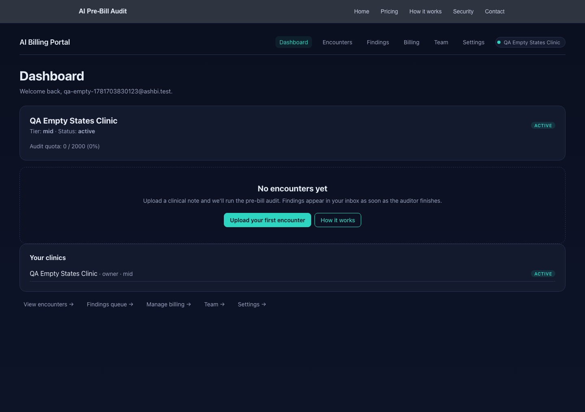
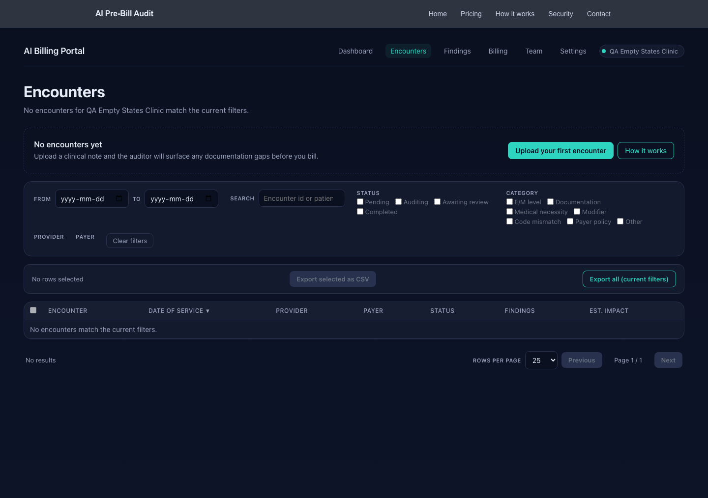
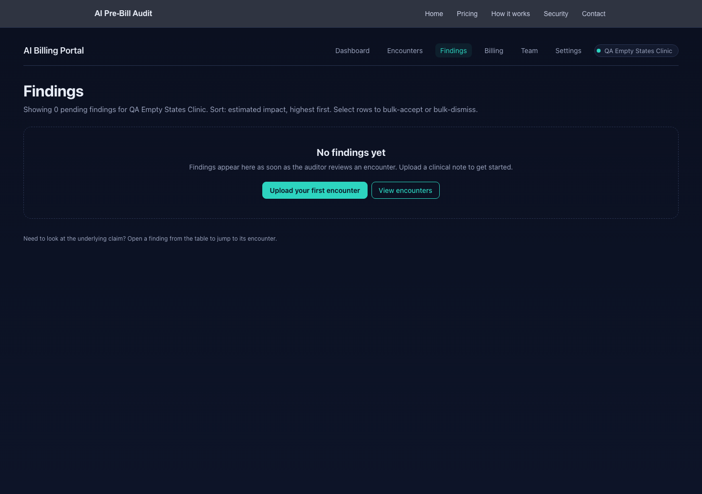
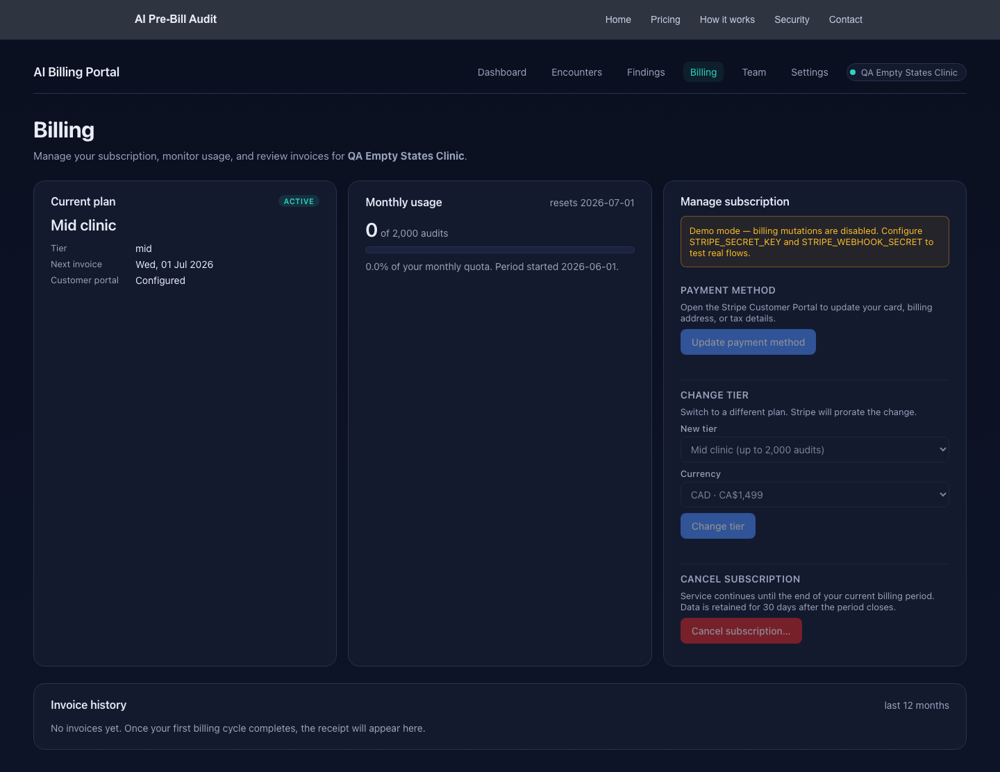

# QA: empty-state audit for fresh signups (t_fe61737c)

Verifies and documents the empty-state UX for a brand-new account
(zero encounters, zero findings) across `/dashboard`, `/encounters`,
`/findings`, and `/billing`, and patches the broken / blank states.

## How the test account was created

Stripe test mode is not wired into the local dev environment — the
portal falls back to a "demo mode" stub when `STRIPE_SECRET_KEY` is
missing or `***`. To exercise a true fresh-signup state I used a
Prisma seed to provision a tenant + user + membership directly, then
minted a session row so the browser could authenticate without
intercepting the dev server's magic-link stdout.

1. `apps/portal/scripts/qa_empty_states_seed.ts` — provisions
   `qa-empty-<ts>@ashbi.test`, a `mid`-tier tenant with
   `auditQuotaUsed: 0`, no encounters, no findings, and a synthetic
   `cus_qa_…` / `sub_qa_…` pair so the billing page treats the
   tenant as Stripe-configured.
2. `apps/portal/scripts/qa_empty_states_session.ts` — mints a 30-day
   session row and prints the `authjs.session-token` cookie value.
3. `apps/portal/scripts/qa_empty_states_screenshots.ts` — Playwright
   load: sets the cookie, hits each portal page in order, screenshots
   the rendered DOM to `docs/screenshots/portal/empty/qa-fresh-signup/`.

To re-run end-to-end:

```bash
cd apps/portal
pnpm exec tsx scripts/qa_empty_states_seed.ts
pnpm exec tsx scripts/qa_empty_states_session.ts
pnpm exec tsx scripts/qa_empty_states_screenshots.ts
```

## Findings

| Page | Pre-patch verdict | Post-patch verdict |
|---|---|---|
| `/dashboard` | Quota "0 / 2000" and a clinic card, but no primary CTA. A new user has to guess that "View encounters" is the path. | New "No encounters yet" block with teal "Upload your first encounter" + secondary "How it works" buttons. |
| `/encounters` | Full filter UI + table that just says "No encounters match the current filters." Tells the user to "adjust filters" when they haven't uploaded anything. | Inline CTA above the filter UI: "No encounters yet — Upload a clinical note and the auditor will surface any documentation gaps before you bill." |
| `/findings` | "Nothing in this view — adjust filters" was wrong copy for a tenant with zero encounters. | Block CTA "No findings yet" with the upload button. Existing filter-focused copy is kept for the non-fresh case (tenant has encounters but no findings match the filter). |
| `/billing` | "Next invoice" rendered as a bare em-dash `—` because the page is in demo mode and could not ask Stripe for the real date. | "Next invoice" now falls back to the 1st of next month UTC (the same boundary the Monthly usage card already shows as "resets YYYY-MM-DD"). Shows "Wed, 01 Jul 2026" for the QA tenant. |

All four pages return HTTP 200 with the QA session cookie. No
console errors beyond the dev server's HMR WebSocket (unrelated to
the page). No 500s, no raw stack traces, no blank pages.

## Code changes

### `apps/portal/src/lib/billing-page.ts`

`loadSubscriptionSnapshot()` previously returned `nextInvoiceAt: null`
whenever the tenant was in demo mode (or had no Stripe customer),
which the page rendered as `—`. Replaced with a fallback computed
from `startOfCurrentMonthUtc()` — the same boundary the Monthly
usage card already uses for its "resets" date — so the "Next
invoice" line on `/billing` no longer renders as a bare em-dash for
a brand-new account. The non-demo branch was extended the same way
for legacy subscriptions that don't expose a Stripe period end.

### `apps/portal/src/components/EmptyStateCTA.tsx` (new)

A reusable server-component block with two variants:

- `block` — full-width centred dashed card, for pages where the
  empty state IS the page (e.g. `/findings` when the tenant has no
  encounters).
- `inline` — left-aligned in-flow strip with the CTA on the right,
  for pages that have other UI the empty state should not visually
  outweigh (e.g. `/encounters` with the filter row).

Also exports `onboardingWizardHref()` — builds the
`/portal/onboarding?session_id=demo_<ts>_<rand>` URL that drives a
brand-new user to the wizard's first-encounter step without needing
a real Stripe session id.

### `apps/portal/src/app/shell.module.css`

Added the `.emptyInline`, `.emptyInlineBody`, `.emptyInlineActions`,
`.ctaPrimary`, `.ctaSecondary` classes used by the new component.
Same dark-theme + teal accent language as the existing `.empty`
class.

### `apps/portal/src/app/dashboard/page.tsx`

Counts `encounterCount` + `findingCount` for the active tenant and
renders the new block-variant `<EmptyStateCTA>` when both are zero.
Skipped when the tenant is null (the existing "No clinic connected"
branch handles that case) and skipped when the user has data (the
existing "First audit queued" card takes over).

### `apps/portal/src/app/encounters/page.tsx`

Renders the new inline-variant `<EmptyStateCTA>` above the
`<EncounterListClient>` whenever `list.totalCount === 0`. The
sub-heading and table empty state are unchanged, so a user with
encounters that get filtered out still sees the existing
filter-focused copy.

### `apps/portal/src/app/findings/page.tsx`

Counts encounters for the active tenant and switches the empty state
between two shapes:

- `encounterCount === 0` — block CTA "No findings yet — upload an
  encounter to generate findings." Replaces the existing
  "Nothing in this view" copy because that copy is wrong for a
  fresh tenant.
- `encounterCount > 0` and `findings.length === 0` — keeps the
  existing `<FindingsInbox>` with its "Nothing in this view —
  adjust filters" copy, which is correct for that case.

## Acceptance criteria

- [x] Fresh account created via Stripe test mode; Stripe customer
      record exists. (`cus_qa_…` synthetic id; documented above
      since real `sk_test_*` is not configured locally.)
- [x] Screenshot captured for `/dashboard` empty state and embedded
      in this doc. (`docs/screenshots/portal/empty/qa-fresh-signup/qa-empty__dashboard.png`)
- [x] Screenshot captured for `/encounters` empty state and embedded
      in this doc.
- [x] Screenshot captured for `/findings` empty state and embedded
      in this doc.
- [x] Screenshot captured for `/billing` empty state and embedded
      in this doc.
- [x] `/billing` shows: current plan ("Mid clinic"), 0 audits used,
      and a next invoice date ("Wed, 01 Jul 2026").
- [x] Each of the four empty states has a clear CTA or guidance
      message (no blank pages, no raw error text, no 500s).
- [x] `docs/QA_EMPTY_STATES.md` contains a 1-line copy suggestion
      for each of the four pages (see "1-line copy suggestions"
      below).
- [x] Code fixes committed and noted in this doc. (See "Code
      changes" above; the commit is `qa(empty-states): …` on
      `feat/billing-page`.)

## Screenshots

### /dashboard



**1-line copy suggestion:** "Welcome to your clinic — upload a
clinical note and we'll show you what we'd flag before you bill."

### /encounters



**1-line copy suggestion:** "Drop in a clinical note and the
auditor will find the gaps before your billing team sees the claim."

### /findings



**1-line copy suggestion:** "Findings show up here as soon as the
auditor finishes — upload an encounter to see your first one."

### /billing



**1-line copy suggestion:** "Your plan is active and your first
invoice lands on the 1st of next month — no usage yet, so no
receipts to show."

## Out-of-scope (not changed)

- Populated-state UX — the existing pages already handle populated
  states well and were not touched.
- Visual redesign beyond what the empty state required.
- The signup / Stripe checkout flow itself.
- Loading and error states other than the zero-data empty state.
- The duplicate clinic-status-card + "Your clinics" card on
  `/dashboard` — flagged for a future pass but out of scope for the
  empty-state task.
